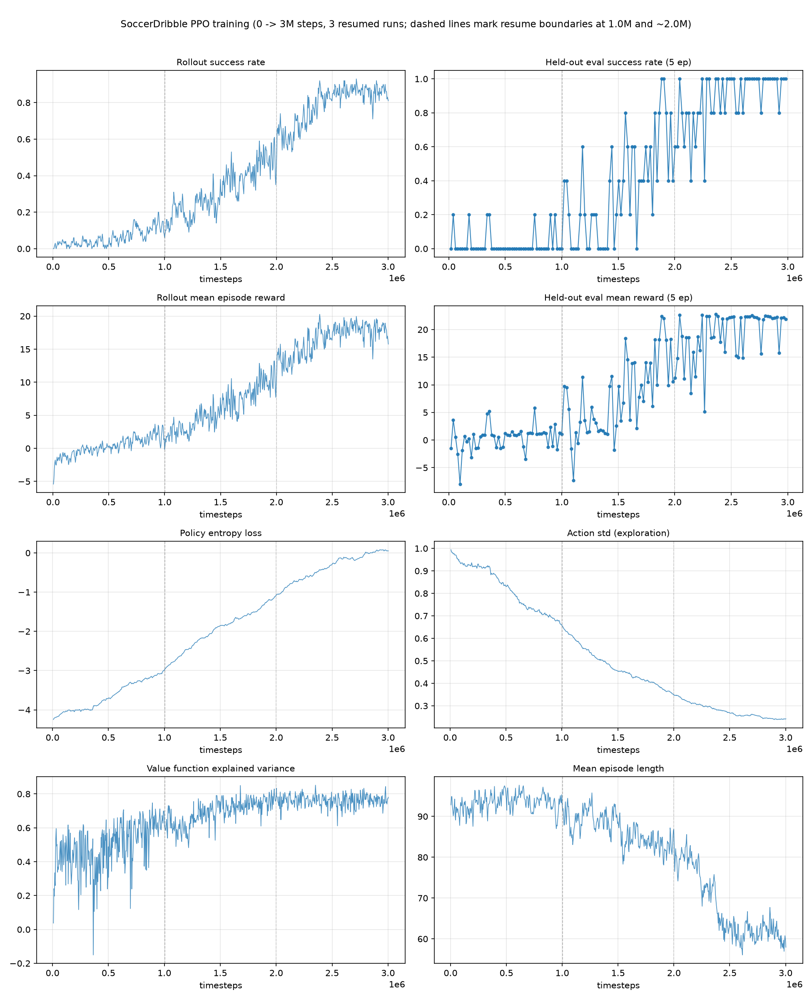
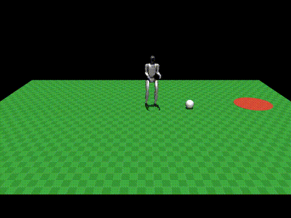

# SoccerDribble：分层人形机器人足球带球演示

[English](README.md)

一个人形机器人分层控制的最小化演示：一个**冻结的、预训练的底层行走策略**驱动
Unitree G1 人形机器人，一个用 **RL（PPO）训练的小型 MLP"决策大脑"**位于其上层，
输出速度指令，让机器人走向足球并将其带到一个随机放置的目标圆圈，场地为
8m x 6m 的小场地。

这遵循人形足球分层控制中常见的两级划分（感知 → 高层"教练"策略 → 底层"运动"
策略）：这里只训练高层策略，底层被视为一个外部黑盒。

## 这是什么 / 不是什么

- **是**：一个独立的、从零搭建的 MuJoCo + Gymnasium + stable-baselines3 演示。
  它遵循 starVLA 的 `examples/simBenchmarks/<Bench>/{train_files,eval_files}`
  目录布局约定，但除此之外**与 starVLA 的模型注册表、训练循环、部署服务完全
  独立**——不涉及 `starVLA/model/framework/` 或 `starVLA/training/`。RL（奖励、
  rollout、PPO 更新）在 starVLA 的监督式模仿学习训练循环里没有对应物，所以这个
  演示端到端运行自己的脚本。
- **不是**：生产级、经过鲁棒性验证、或已具备 sim-to-real 能力的方案。训练足够
  久（300万步）后确实能达到较高（84%）的成功率——见下方"结果"——但这里没有
  域随机化（domain randomization）：物理参数固定、观测无噪声、动作无延迟，
  所以这仍然是一个"验证分层结构是否work"的演示，还没有被证明能在物理/传感器
  失配的情况下存活。目前只实现了单机器人/单球/随机目标的任务；自然的后续方向
  是双机器人对抗带球，再到多机器人战术层，但这些超出了本演示的范围。

## 结果

参考训练（`train_files/runs/ppo_v1`）是同一个 PPO 策略（`MlpPolicy`，
`net_arch=[64,64]`，超参数与 `train_files/config.py` 中一致），通过
`train_ppo.py --resume` 分三次启动逐步训练更久，全部写入同一个 `runs/ppo_v1/`
目录：

| 轮次 | 累计步数 | 新增步数 | 用时 | 备注 |
|---|---|---|---|---|
| 1（首次） | 0 → 500,000 | 500,000 | 53.0 分钟 | `checkpoints/rl_model_500000_steps.zip` |
| 2（`--resume`） | 500,000 → 1,003,808 | ~503,808 | 51.0 分钟 | `final_model.zip`（100万步快照） |
| 3（`--resume`） | 1,003,808 → 3,002,656 | ~1,998,848 | 181.1 分钟 | 当前的 `final_model.zip` / `best_model.zip` |

全部训练均为纯 CPU，`n_envs=8`（约 160-220 steps/s）；三轮加起来总用时约
**4.75 小时**，跑满 300 万步。

在**300万步**时，`train_files/runs/ppo_v1/best_model/best_model.zip` 在 100 个
留出评估 episode 上达到 **84% 成功率**（球到达目标圆圈），平均 reward 18.46，
平均 episode 长度 71.8 步——相比 100万步时的 8%（这个原始参考数字仍保留在
`train_files/runs/ppo_v1/train.log` 的早期记录里）是大幅跃升。这个跃升证实了
100万步的策略是训练不足，而非模型容量到顶：`heuristic_baseline.py` 脚本式策略
仍然只有约 5% 的成功率，说明训练后的策略现在是大幅、而非小幅地超越了它。

从完整的 0→300万步曲线（`train_files/runs/ppo_v1/PPO_1` 的 TensorBoard 日志，
绘制如下图）中可以看到支持"训练到收敛，而非仅仅训练更久"的信号：
`train/entropy_loss` 从 -4.25 升到 ≈0，`train/std`（动作标准差）从 0.99 降到
≈0.24，说明策略已经收敛为近乎确定性的行为；`train/explained_variance` 稳定在
0.75-0.85 附近；`rollout/ep_len_mean` 从约 90 步降到约 60 步，说明成功的
episode 不仅更多，完成速度也更快。



*（如需在进一步训练后重新生成，运行 `python train_files/plot_training_curves.py
--logdir train_files/runs/ppo_v1`——它读取的是 TensorBoard 事件文件，这些文件
在多次 `--resume` 启动之间保持连续；而每次运行 `train_ppo.py` 都会重新生成的
`monitor/*.csv` 和 `eval/evaluations.npz` 则会被清空重写，不具备这个连续性。）*

训练过程中出现并修复了两个 reward hacking 回归问题，如果你要扩展奖励函数，
这两点值得了解：（1）一个使用绝对值计算的对齐奖励项，让策略仅靠"出生在一个
有利位置"就能白拿奖励，而不需要真的移动过去——修复方式是奖励每一步对齐度的
*变化量*，而不是它的绝对值；（2）把带球进度奖励限制在进入 `dribble_range`
阈值之后才生效,导致"仍在接近球的过程中偶然碰到球"这种情况拿不到任何信号,使得
"先接近、再发现能推动球"这种组合行为对 PPO 的随机探索来说太罕见,几乎学不到——
修复方式是让这一项无条件生效（它只会在真正有进展时才变宽,不会被"不碰球"这种
行为白嫖,因为球没被碰到时 Δdist_ball_target 本身就约等于 0）。

一段来自 300 万步模型的成功带球录像，录制方式与下方"用法"中的 `--save-video`
示例相同（为了能在 GitHub 上正常渲染，这里用 GIF；原始 `.mp4` 文件位于
`examples/simBenchmarks/SoccerDribble/eval_files/dribble_success_demo.mp4`）：



## 架构

```
教练策略（训练得到）              运动策略（冻结，预训练）
5 Hz，MLP [64, 64]                50 Hz，LSTM（Unitree 的 motion.pt）
观测：球/目标几何信息        -->  观测：关节状态 + 速度指令 + 步态相位
      机器人自身坐标系              动作：12-DOF 关节位置目标 -> PD
动作：Δ(vx, vy, yaw_rate)              |
      （累加进指令）                  v
                                  MuJoCo 物理仿真（500 Hz）
```

- **底层**（`train_files/low_level_policy.py`）：封装 Unitree 官方预训练的 G1
  行走策略（`assets/policy/motion.pt`，TorchScript LSTM，在 Isaac Gym 中用 RL
  训练——见 `assets/UNITREE_RL_GYM_LICENSE`，BSD-3 协议）。从不重新训练；这个
  封装重现了 `unitree_rl_gym` 标准的 sim2sim PD 控制循环（角速度/重力投影/
  关节状态/步态相位观测，去掉了交互式查看器/键盘控制部分）。
- **高层**（`train_files/soccer_env.py`，由 `train_files/train_ppo.py`
  训练）：一个 `gymnasium.Env`，内部驱动底层策略，暴露一个 13 维观测（机器人
  坐标系下的球/目标位置、距离、机器人速度/朝向、上一次指令）和一个 3 维有界
  动作（`Δcmd`），奖励分两个阶段设计——先缩短到球的距离，再把球推向目标同时
  限制球速避免把球踢飞。
- **场地**：`assets/soccer_field.xml`，8m x 6m（比真实球场小，是故意为之，让
  episode 保持简短）；球的物理参数接近 FIFA 标准比例（半径 0.11m，质量
  0.43kg）。目标圆圈是一个 mocap body，每次 `reset()` 时随机重新放置。

## 环境搭建（venv，非 conda）

需要 Python 3.11（mujoco/torch 的预编译 wheel 目前在所有平台上对 3.12+ 的支持
还不够可靠）。

```bash
cd train_files
./setup_env.sh          # 创建 train_files/.venv
source .venv/bin/activate
```

## 用法

```bash
cd train_files
source .venv/bin/activate

# 1. 用一个脚本式（非学习）控制器验证环境/奖励是否work。
python heuristic_baseline.py --episodes 20

# 2. 训练高层 PPO 策略。
python train_ppo.py --timesteps 2000000 --n-envs 8 --logdir runs/ppo_v1

# 2b. 也可以从最新的 checkpoint/final model 续训,训练更久——
# 已提交的 runs/ppo_v1 参考训练就是这样从 100万步续训到 300万步的（见"结果"）：
python train_ppo.py --timesteps 3000000 --n-envs 8 --logdir runs/ppo_v1 \
    --resume runs/ppo_v1/final_model.zip

# 3. 评估一个 checkpoint（用比默认值 20 更多的 episode 数以降低成功率估计的
# 方差——上方"结果"一节用的是 100）。
cd ../eval_files
python eval_soccer.py --model ../train_files/runs/ppo_v1/best_model/best_model.zip --episodes 100
python eval_soccer.py --model ../train_files/runs/ppo_v1/best_model/best_model.zip --episodes 1 --save-video rollout.mp4

# 上面第一条评估命令的等价快捷方式（需在 eval_files/ 目录下运行；
# 模型路径是相对于 train_files/ 的）：
./run_eval.sh runs/ppo_v1/best_model/best_model.zip 20
```

用 TensorBoard 监控训练：`tensorboard --logdir train_files/runs/ppo_v1`。
如果想要静态图片（例如嵌入文档），见 `train_files/plot_training_curves.py`，
"结果"一节中的图就是用它生成的。

## 来源说明

`assets/g1_description/`（MJCF + 网格模型）、`assets/policy/motion.pt`、以及
`assets/UNITREE_RL_GYM_LICENSE` 均取自 Unitree Robotics 的开源项目
[`unitree_rl_gym`](https://github.com/unitreerobotics/unitree_rl_gym)
（BSD-3-Clause 协议）。这里只包含了 12-DOF G1 sim2sim 行走策略所需的文件
（不包含完整的手臂/手部模型，也不包含 Isaac Gym 训练代码）。
